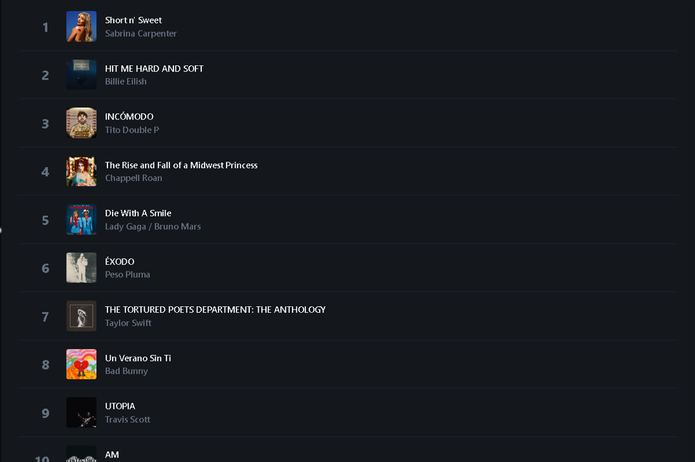
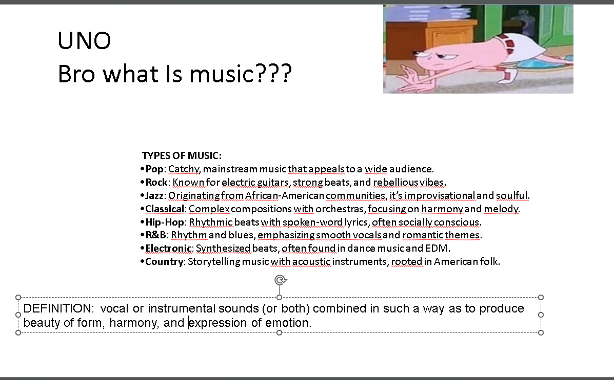

<header>Noobilly - Amazing Creative Student, also known as Fluis230</header>

<nav>
  <a href="#about">About Me</a>
  <a href="#skills">Skills</a>
  <a href="#projects">Projects</a>
  <a href="#ideas">Project Ideas</a>
  <a href="#resume">Resume</a>
  <a href="#updates">Updates</a>
  <a href="#special-projects">Special Projects</a>
  <a href="#special-videos">Special Project Videos</a>
  <a href="#videos">Project Videos</a>
  <a href="#The-Brookhaven-Purge">The Brookhaven Purge</a>
  <a href="#done-projects">Done Projects/Projects for Later</a>
</nav>

<section id="about">
  <h2>About Me</h2>
  
Hello, I'm Noobilly, or Mahdi in real life. I'm just a student at school who loves making projects. This website is about my "projects"! My key skills include not only being very smart but also being great at brainstorming, so I can generate project ideas quickly.

</section>

<section id="skills">
  <h2>Skills</h2>
  
My key skills are that I'm not only very smart but I'm good at brainstorming, allowing me to make a project idea very quickly.

</section>

<section id="projects">
  <h2>Projects</h2>
  
Some of the projects I've already completed in previous years include:

  <ul>
    <li>A long project portrayed as an adventure game about pollution, which is very entertaining.</li>
    <li>A cool, informative project including a fun quiz at the end.</li>
    <li>The project I showed you all on the 25th of September 2024.</li>
    <li>Many more projects, including one filled with memes!</li>
  </ul>
</section>

<section id="ideas">
  <h2>Project Ideas</h2>
  
My project ideas are small, but here are a few:

  <ul>
    <li>A project about music—something I love and find important!</li>
    <li>A project about geography, mainly focusing on countries and the history of those countries.</li>
  </ul>
</section>

<section id="resume">
  <h2>Resume</h2>
  <a class="button" href="#">Download Resume</a>
</section>

<section id="updates">
  <h2>Updates</h2>
  
UPDATE 1: Creation of website

  
UPDATE 2: Addition of 2 new projects, one new project summary, and Yahya's YouTube channel

  
UPDATE 2.0: Addition of "Updates" section, "Special Projects Video" section, and downloaded projects summary

  
UPDATE 2.1: Addition of "Row row, row your boat!" the project and SallyNo game project

  
<strong>UPDATE 2.2: Addition of Trivia Event</strong>

  
UPDATE 2.3: Addition of "SALLY THE IIND-ORIGINS" the project and project summary. Addition of "The Brookhaven Purge" section

</section>

<section id="special-projects">
  <h2>Special Projects</h2>
  <h3>The Special Sally - A Unique Halloween Edition</h3>
  
This project takes you on an exclusive Halloween-themed journey, with Sally grappling with her own doubts and insecurities after a failed battle. It's not just about power but finding inner strength through the support of friends and mentors. Through eerie encounters and some spooky moments, Sally comes to understand that she doesn't need to prove herself to anyone. It’s an inspiring yet fun story made with special Halloween vibes—only available on my site and channel!

  <h3>Row row, row your boat</h3>
  
Enjoy this project that shows the journey of Noobilly, Kacy, and Bacon Hair finding the 55th number and a rowing of a boat. Noobilly wanted to sacrifice a Kayatron [Kayatron: an endangered species, which the last one alive is Kacy—or is it only Kacy??]. To gain hacks and keep Kacy alive, they needed to find a rowing of a boat, which the 55th number knows the answer to. But to find the 55th number, they had to pass 3 trials: the trial of unity, the trial of strength, and the trial of sacrifice.

</section>

<section id="special-videos">
  <h2>Special Project Videos</h2>
  <h3>The Special Sally - Full Halloween Edition</h3>
  <iframe src="https://www.youtube.com/embed/Htnmg_I9wWM" allowfullscreen></iframe>
  
  <h3>Row row, row your boat! Official Episode</h3>
  <iframe src="https://www.youtube.com/embed/Vs4f2XefoCw" allowfullscreen></iframe>
</section>

<section id="videos">
  <h2>Project Videos</h2>
  <iframe src="https://www.youtube.com/embed/Ef-MYFyhCgo" allowfullscreen></iframe>
  <iframe src="https://www.youtube.com/embed/lDPTmpx1q3c" allowfullscreen></iframe>
  <iframe src="https://www.youtube.com/embed/--o-T-6aDz8" allowfullscreen></iframe>
  <iframe src="https://www.youtube.com/embed/AL_rP6lCXnw" allowfullscreen></iframe>
</section>

Project Summary
KIRBY AND ADEN PAULE VERSUS THE WATER ROAMERS

To fully understand the lore of THE ALLIES, I've added this project that was made a year ago. Pollution is a very big problem, so Kirby went to Jeaut-Paulia to fight the king of the water roamers, who are the people who pollute. To ask for directions, Kirby went to Carol Paule. Then Kirby went to Maester Paule to get a book to fully understand pollution. For the battle to be easier, Kirby went to Farmer Paule to get some food. So then Kirby meets Aden Paule near the exit of the "Lost Sacred Land Of Water Roamers". After arriving, Aden Paule puts down his backpack and both of them get ready for battle. The battle was harsh, but they've won it. So then with their arrival with a yacht, they meet the historian Samuel Paule who has written the history of every battle that has happened in Jeaut-Paulia. And so then does the tides change and the world is in peace!

<strong>BOOK 1 in THE ALLIES:</strong> Earthworm Sally has lost her parents, and she's trying to win a gameshow hosted by Kacy with contestants: Coca Cola can, Noobilly, Bacon Hair, Shrek, and Earthworm Sally herself. She hasn't won the gameshow, so she got mad and challenged Kacy to a fight. Thanks to Kacy's hacking aids, she has won. Earthworm Sally was astonished by her strength and decided to ask Kacy to help her with the fight happening in Jeaut-Paulia, to fight the big storm. The other contestants have agreed, including Kacy. What will happen next? Find out in BOOK 2.

<strong>BOOK 2 in THE ALLIES: MUSIC</strong>

Now our heroes will go fight the storm. You know, how about letting Aden Paule tell you about this. Here is Aden Paule's text, oh and by the way he is addressing this to Earthworm Sally: When you came to Jeaut-Paulia, the adventure began. Earthworm Sally and Coca Cola Can took to the skies in a plane, while Noobilly and his grandpa sailed in on a boat. Kacy and Bacon Hair flew, thanks to their trusty hacks. Once they landed, they discovered Maester Paule’s books, and there it was—the secret: music, the storm’s great weakness. The battle against the storm was fierce. But in a twist of fate, everyone except Sally was pulled into a black hole, thrown back to Jeaut-Paulia. Kacy and Bacon Hair, though, hacked their way back, only to be banned instantly. Sally, now armed with a saber, faced the storm alone, until the spirit of Aden Paule rose to her side, lending strength. Kacy, ever the hacker, unbanned herself just in time to come to Sally's rescue. In that moment, Sally awakened her ultimate form. Together, they fought with all their might, and in a single, decisive strike—boom—the storm was no more. Sally, you are powerful and unstoppable.

<em>THE END –Samuel Paule</em>

<strong>EPISODE 6 in THE ALLIES: SALLY THE IIND-ORIGINS:</strong> The Forgotten Echoes of Eshmir
A journey into the unknown. A land that defies time. A legend that refuses to be forgotten.

Chapter 1: A Story of the Past
Kacy asks Sally for a tale, and she tells the story of her grandfather, Sally the IIND. He once embarked on an expedition with Saaida Al-Hmounia, a brilliant explorer obsessed with the ever-shifting plateau of Eshmir. Legends spoke of a monolith within Eshmir that distorted time and space—an anomaly no map could ever capture. With journal in hand, Sally the IIND recorded every strange occurrence as they ventured deeper into the unknown.

Chapter 2: A World That Changes
As they traversed Eshmir’s unstable terrain, reality itself seemed to bend:
Rocks hovered in the air before settling.
Water flowed in reverse.
Landmarks moved when unobserved.
Saaida attempted to rationalize it—unstable fault lines, magnetic anomalies—but the deeper they went, the more their senses betrayed them. Their maps became useless. Their footprints disappeared. Then, at last, they found it—the monolith. A massive, humming structure that distorted everything around it.

Chapter 3: Science vs. the Impossible
The closer they got, the more the world unraveled. Compasses spun out of control. Voices echoed incorrectly. Saaida placed markers to track their movements—yet, when they turned back, the markers were gone. The truth dawned on them: Eshmir wasn’t shifting. Eshmir was alive.
Saaida touched the monolith, and reality itself cracked apart. The world shimmered, distorted—and they fell.

Chapter 4: The Monolith’s Curse
When they awoke, everything looked the same. But something was wrong. The sky was a different shade. Their footprints from before were missing. Had they traveled through time? Had the monolith transported them?
Then, Saaida changed. Her movements slowed, her voice delayed. She whispered, "I don’t think this is our world anymore."
And then, in the distance, footsteps. They were not alone.

Chapter 5: The Eternal Trap
Sally the IIND realized the truth: the monolith had pulled them into an altered version of reality. Eshmir was not just a place—it was a sentient trap. And Saaida… she was becoming part of it. He ran, reaching for the monolith one last time—
Then, everything went black.
When he awoke, she was gone.
His final journal entry read: "If you find this, do not trust your eyes. Eshmir is never what it seems."

Chapter 6: The Cycle Repeats
Years later, Sally and the modern-day Saaida followed his grandfather’s path. They found the monolith. They touched it.
And they woke up in a world that looked the same but felt wrong. Had they escaped? Or had Eshmir simply tricked them into believing they had?
As they walked away, a tree in the distance shifted.
Then the sun flickered.
The illusion remained.

Post-Credit Twist: The Final Glitch
Descending the plateau, Sally noticed something terrifying—
A set of footprints.
Not theirs.
Circling endlessly.
Saaida gasped. Buried beneath the dirt was a journal—old, battered, barely legible. On the cover, in shaky handwriting:
Sally the IIND.
If he had left it behind… that meant one thing:
He never made it out.
BLACK SCREEN.
THE END…?

<section id="The Brookhaven Purge">
  <h2>The Brookhaven Purge</h2>
  
The brookhaven purge is a 7 10 minutes or so episodes series made by me and my friends.. Starting from the 13th of March 2025 episode 1 and episode 2 will drop. And then, each friday, each week, 2 new episodes will drop. The series will be airing during the whole month of ramadan. To make you more into the series: a synoposis, which is a brief sumary, will be in this section each 2 days before the episode. Wednesdays and Thursdays. I hope you enjoy the series! Only avaible in: noobilly-pixel.github.io and GAAIMM.github.io 
Remark! GAAIMM.github.io website is still in process and unfinished. The website will work promptly on the 12th March. Thank your for your waiting and understanding..

</section>

<section id="done-projects">
  <h2>Done Projects/Projects for Later</h2>
  
Here are the projects that will be presented in class for 2024:

  <ul>
    
    <li><strong>September:</strong> Sports and Games Project</li>
    <li><strong>October:</strong> Music (the storm's ally is music; finished in November)</li>
    <li><strong>November:</strong> SallyNo (SallyNo was finished on December 6th)</li>
    <li><strong>December:</strong> Handmade Arts & Trivia (presented)</li>
    <li><strong>February:</strong> Geography & Science(presented)</li>
    <li><strong>March:</strong>The Brookhaven Purge(check section for info)</li>
  </ul>
</section>

<section id="event-trivia">
  <h2>EVENT - TRIVIA</h2>
  
<em>Well hello! Welcome! So in here you will find all the information regarding the trivia that I've told you about. It will **most likely** be on January 15th. But it could also be the 17th. I will inform you on January 3rd when it will really be. To sum up, it will be a trivia-jeopard that will be based on points. I will ask you a series of questions that you will choose the points for, let me explain. There will be 11 categories: Handmade arts, music, sports, the allies, games, geography, history, general knowledge, listening/ reading and SALLYNO. You already know 6 of them, and 5 of them are some you already know about them. I will ask you to choose a point form: 100,200,300,400 or 500. From easiest to hardest (meaning 100 is easy, 200 medium as well as 300, 400 hard and 500 extreme). If you manage to answer a 100 points question you win the value, but if you fail to do so, you lose it. If you have any questions about this, feel free to ask me in my contacts or face to face at school. Yes, there will be a prize for the winner. You must create teams of 5 people (minimum 3 people).  You must create them, if you want to participate, before the trivia event. </em>

  <h3>I. HANDMADE ARTS:</h3>
  
<em>[My introduction]</em>

  
Handmade arts involve creating objects using manual skills and creativity, often without the use of large machinery. This includes a variety of forms such as textile arts (weaving, knitting, crocheting, embroidery, and quilting), ceramics and pottery (used to make mugs and other items), woodworking (lathe is a common tool), jewelry making (beading and wire wrapping), and paper crafts (origami and papercutting). Handmade arts allow for personal expression and the creation of unique items.

  
<em>If you have any questions feel free to ask me<</em>

  <h3>II. MUSIC</h3>
  
<em>[My introduction]</em>

  
Music is fascinating too isn't it? From albums: (definition of albums: Albums are collections of songs that an artist or band creates to explore a theme, story, or mood. Each song (or "track") on the album can have its own vibe, but together, they form a complete experience. Think of it as a book with each track as a chapter. Some tracks might be upbeat and fun, while others are more emotional or reflective, creating a journey for the listener from start to finish.) (types of albums: Types of Albums:
Studio Album: A complete set of new, original songs recorded in a studio.
Live Album: Recordings of performances in front of an audience, capturing raw energy.
Compilation Album: Collections of songs from various sources, like hits or rare tracks.
EP (Extended Play): A short album with a few songs, longer than a single but shorter than a full album.
Soundtrack: Music specifically created for movies, TV shows, or games, often conveying mood and story.) (Biggest albums of 2024: in the picture)

. There are many artists with very popular tracks and albums. I did not say what tracks are? OH! Tracks are really the songs in an album and there are 2 types for tracks: Normal Tracks and Singles. Singles also have types unlike Normal Tracks: Types of Tracks:
Lead Single: The main song released to promote an album.
Title Track: A song that shares the album’s name and often reflects its theme.
Interlude: A short, sometimes instrumental piece that bridges parts of an album.
Hidden Track: An unlisted song, usually added at the end as a surprise.
Bonus Track: Extra songs included on special editions of albums, often as a reward for fans.

If you want to know about Artists biggest albums and singles you can find it in the video in Trivia videos section.
But some Artists's albums are: Micheal Jackson's Thriller which is the biggest album of all time ; Taylor Swift's 1989 ;  Katy Perry's Teenage Dream ; Bruno Mars's Unorthdox Jukebox ; Drake's For All The dogs ....

Albums & tracks can be used both digitaly and hardware type. Digitaly with apps like: Spotify, Apple Music, Iheart Radio... Hardware type like: Vinyls ; Cds; Cassettes ; Radios....
An artist can record multiple albums, more than 1.

Now for the defintion of music and it's types, there are located in the picture. 

Some of the biggest albums of all times are: Micheal Jackson's Thriller ; Taylor Swift's 1989 ;  Katy Perry's Prism ; Bruno Mars's Doo woops and Hooligans ; Whitney Houston with Various Artists's The bodyguard ; The Eagles's Hotel California ....

  
<em>If you have any questions feel free to ask me</em>

    <h3>III. THE ALLIES:</h3>
  
<em>All about the story of the allies. You can watch the episodes, or just read the resume of the episodes!</em>

  
So,for the allies, I will ask you questions on the following episodes: KIRBY AND ADEN PAULE VERSUS THE WATER ROAMERS. Book 1 & Book 2 of the allies. And the three special projects: The special Sally, Row row, row your boat! and A very much sally christmas.]   For more information, read the introduction.

  
<em>If you have any questions feel free to ask me<</em>

    <iframe width="560" height="202" src="https://www.bandlab.com/embed/?id=87ce3def-5418-f011-aaa7-0022484892d6" allowfullscreen></iframe>
</section>

<footer>
  
&copy; 2024 Noobilly's Project Hub

</footer>
